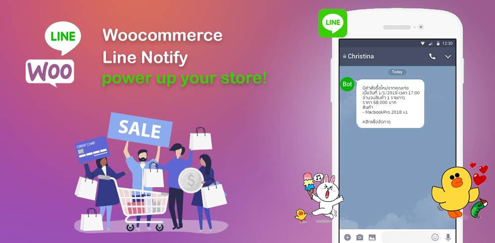
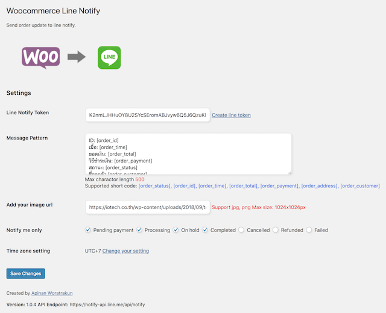
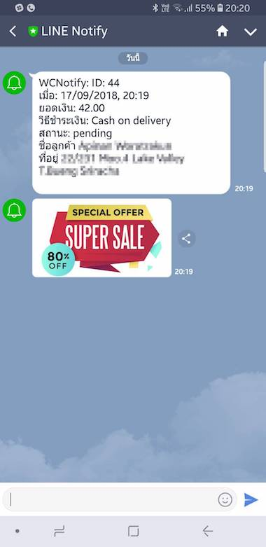

# Woocommerce Line Notify
Woocommerce order notification to Line notify API.

## อธิบายเกี่ยวกับสิทธิในการใช้งานที่ทุกอย่างฟรีหมดโดยมีเงื่อนไขดังนี้
* ไม่อนุญาตให้จำหน่ายซอฟต์แวร์ต้นฉบับโดยไม่มีการพัฒนาปรับปรุงซอฟต์แวร์เพิ่มเติมหรือขายต่อในลักษณะซอฟต์แวร์เดี่ยว เช่นการนำซอฟต์แวร์นี้ไปขายต่อให้ผู้อื่น  
* ต้องแจ้งรายละเอียดการแก้ไขให้กับผู้พัฒนาทราบว่าได้แก้ไขอย่างไรบ้างในตัวซอฟต์แวร์
* แต่อนุญาตใช้เพื่อการเป็นส่วนประกอบของทำโปรเจคใดๆ ทั้งฟรีและไม่ฟรี
* ผู้พัฒนาไม่มีส่วนเกี่ยวข้องใดๆกับความเสียหายที่เกิดขึ้นจากการทำงานของซอฟต์แวร์ ผู้ใช้ยินดียอมรับความเสี่ยงนั้น

[Download](https://git.iotech.co.th/iamapinan/woocommerce-line-notify/-/archive/master/woocommerce-line-notify-master.zip) zip file here.

## v1.0.6 Changes log
- [เพิ่ม Shortcode `[product]` เพื่อแสดงรายการสินค้าใน alert](https://github.com/iamapinan/Woocommerce-Line-Notify/issues/9)
- ยกเลิกแนบรูป
- กดที่ short code เพื่อเพิ่มลงใน textarea
- แก้ไขการแสดงผล
- ปรับปรุงความเสถียร

## v1.0.5 Changes log
- Remove image require for image field.
- Fixed order status display from status code to status label.
- Add [order_province] to display provice name in Thai only.
- Add [order_phone] to display billing phone number.
- Add [order_company] to display billing company.
- Add [order_note] to display customer notes.
- Add [order_url] to display order details for authorized user.

## v1.0.4 Changes log
- Add image to notification.
- Choose order status to send notification.
- Show timezone setting in your system.
- Fixed timezone [issue](https://github.com/iamapinan/wc_linenotify/issues/1).
- Improved performance by query database when need only.
- Smooth design settings ui.
- Support scss style editing.

## v1.0.3 Changes log
- Fixed time display in alert message.
- Fixed order total in alert message.
- Remove state name.
- Add [order_customer] short code.

## Screenshot
  
Setting page

  
Notification page

## Features
- Add line token.
- Message pattern with order short code supported.
- Send notify to line group or user.
- Send notify when have order activity.
- Add logo or image banner to notification.

## What's benefit of line notify can do.
1. Send a notification to your self.
2. Send a notifycation to your group.
3. Can send text, image and line sticker to the notification message.

## How to install
1. Upload the entire wc_linenotify folder to the /wp-content/plugins/ directory.
2. Activate the plugin through the ‘Plugins’ menu in WordPress.

## Roadmap
- Message pattern for selected status.
- Multiple token id support for message broadcast.
- Message broadcast to line group.
- Add line sticker.
- Attach event url.

## Contibute guidelines
Thank you for your suggestion and support to the project. I very happy to help and give the thing I can do to the world. If you can help me to develop this plugin or join as a team members please follow below. I'll add your name to contributor members if you've joined.
1. Fork this repo on development branch and sync to your local.
2. run `php composer install`
3. Make change to the project.
4. Push & commit update to your branch.
5. Create pull request with update details to developer.
6. Waiting for approved.

### Welcome to the opensource world.

## Wiki
[WIKI](https://github.com/iamapinan/wc_linenotify/wiki)

## Issue
[Issue](https://github.com/iamapinan/wc_linenotify/issues)

## Any support I can do.
* Email: [apinan@iotech.co.th](mailto:apinan@iotech.co.th)
* LineID: iamapinan
* Facebook: [facebook.com/9apinan](https://www.facebook.com/9apinan)

## License
[GNU General Public License v3.0](https://github.com/iamapinan/wc_linenotify/blob/master/LICENSE)
